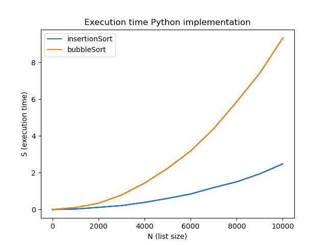
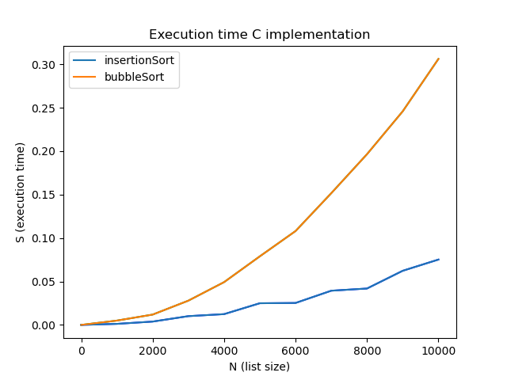

# Sorting_Algorithms
Implementations and comparison of sorting algorithms:
* Bubble Sort
* Insertion Sort 

Tool:
* Tmux terminal
* Vim as text editor 

Libraries in Python:
* Matplotlib
* Random 
* Time

Libraries in C:
* stdlib.h
* stdbool.h
* stdio.h
* time.h

